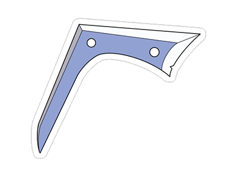

# Sokka

[](https://github.com/afgalvan/Sokka/actions/workflows/dotnet.yml)
[](https://github.com/afgalvan/Sokka/actions/workflows/publish.yml)
[](https://www.nuget.org/packages/Sokka.Template/)

Template for C# socket server with dependency injection in .NET 5.

## Features

- Sockets
- Dependency injection
- Docker & docker compose
- editorconfig

## Installation

```bash
dotnet new -i Sokka.Template
```

## Usage

```bash
dotnet new sokka -o Your.Project
```

## Run it

### From .NET

```bash
# Run the server
cd Your.Project/src/Your.Project.Server
dotnet run

# Run the client
cd Your.Project/src/Your.Project.Client
dotnet run
```

### From Docker

```bash
# Build the containers
docker-compose build

# Run the server container
docker-compose up server

# Run the client container
docker-compose run --rm client
```
